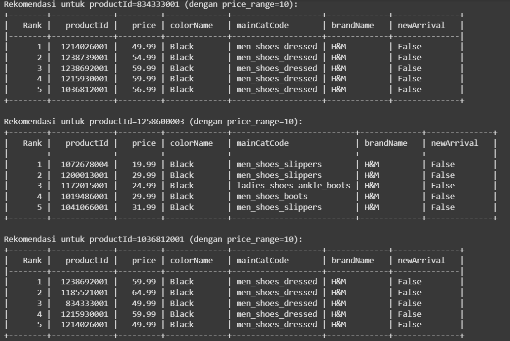

# Laporan Proyek Machine Learning - Ezraliano Sachio Krisnadiva

## Project Overview
Sistem rekomendasi telah menjadi komponen penting dalam industri bisnis fashion untuk meningkatkan pengalaman pengguna dan mendorong penjualan. Proyek ini bertujuan untuk membangun sistem rekomendasi berbasis konten untuk produk H&M, menggunakan dataset yang berisi informasi produk seperti harga, warna, kategori, bahan, dan deskripsi. Dengan memanfaatkan teknik machine learning, proyek ini mengembangkan model yang merekomendasikan produk serupa berdasarkan fitur produk, memberikan solusi yang relevan bagi pengguna yang mencari barang dengan karakteristik tertentu.

Mengapa Proyek Ini Penting?
Sistem rekomendasi merupakan elemen kunci dalam strategi bisnis fashion. Menurut penelitian oleh McKinsey, sistem rekomendasi yang efektif dapat meningkatkan pendapatan hingga 30% melalui personalisasi pengalaman belanja. Proyek ini relevan karena membantu H&M menawarkan rekomendasi produk yang sesuai dengan preferensi pelanggan, sehingga meningkatkan kepuasan dan loyalitas pelanggan.

Refrensi :
- "Recommender Systems Handbook" oleh Ricci, F., Rokach, L., & Shapira, B. (2015). Springer.
-  McKinsey & Company. (2013). How Retailers Can Keep Up with Consumers.

## Business Understanding

### Problem Statements
1. Kurangnya rekomendasi produk yang relevan: Pelanggan sering kesulitan menemukan produk yang sesuai dengan preferensi mereka berdasarkan warna, kategori, atau bahan, yang dapat mengurangi kepuasan belanja online.
2. Data produk yang kompleks: Dataset H&M memiliki berbagai fitur seperti deskripsi teks, harga, dan kategori, yang memerlukan pemrosesan khusus untuk menghasilkan rekomendasi yang bermakna.

### Goals
1. Membangun sistem rekomendasi berbasis konten yang dapat menyarankan produk serupa berdasarkan fitur seperti warna, kategori, merek, harga, deskripsi, dan bahan.
2. Menyediakan rekomendasi yang relevan dengan mempertimbangkan preferensi pelanggan, termasuk batasan harga, untuk meningkatkan pengalaman belanja dan konversi penjualan.

  ### Solution statements
   - Pendekatan 1: Content-Based Filtering dengan Cosine Similarity
Menggunakan fitur produk (kategori, warna, harga, deskripsi) yang diencode dan diubah menjadi vektor untuk menghitung kesamaan antar produk menggunakan cosine similarity. Pendekatan ini sederhana dan efektif untuk dataset dengan fitur yang kaya.

## Data Understanding
Dataset ini berasal pada situs kaggle : (https://www.kaggle.com/datasets/niharpatel03/h-and-m-product-dataset). Dataset ini berisi informasi produk H&M dengan total 9676 baris dan 14 kolom. Data ini mencakup informasi seperti ID produk, harga, warna, kategori, merek, deskripsi, dan bahan. Dataset memiliki beberapa missing values pada kolom colorshades, details, dan materials dan dataset ini memiliki duplikasi data pada kolom productId. Demi memahami dataset ini berikut merupakan penjelasan fitur/variabel yang ada pada dataset ini.

- productId: ID unik untuk setiap produk.
- price: Harga produk dalam dolar.
- colorName: Nama warna produk (misalnya, "Black", "Blue").
- mainCatCode: Kode kategori utama produk (misalnya, "Ladieswear", "Menswear").
- brandName: Nama merek produk.
- newArrival: Status apakah produk baru (True/False).
- details: Deskripsi teks tentang produk.
- materials: Informasi bahan produk.
- colorShades: Nuansa warna produk.
- isOnline, comingSoon, stockState: Status ketersediaan produk.
- url : merupakan kolom url
- productName : nama produk
- colors : merupakan kode warna

Untuk memahami data secara mendalam, saya melakukan proses Univariate Explorasi Data Analysis agar dapat memahami fitur dataset secara mendalam. Berikut hasil Univariate Explorasi Data Analysis yang dilakukan.
1. Distribusi Harga: 
Harga produk bervariasi dari $5 hingga $200, dengan sebagian besar produk berada di kisaran $20–$50 (histogram dan boxplot).
2. Distribusi Kategorikal:
Kolom seperti colorName memiliki banyak kategori unik (>50), sedangkan mainCatCode memiliki beberapa kategori dominan seperti "Ladieswear".
Insight yang didapat adalah data memiliki distribusi harga yang miring ke kanan, dan beberapa kolom seperti isOnline bersifat konstan, sehingga tidak relevan untuk model.

## Data Preparation
Dalam membuat model machine learning, diperlukan sebuah proses data preparation agar model machine learning dapat berjalan dengan optimal, berikut merupakan tahap data preparation.
1. Penanganan Missing Values
Proses :
- Kolom details dan materials diisi dengan string kosong ('') menggunakan fillna('').
- Kolom colorShades diisi dengan "Unknown" menggunakan fillna('Unknown').
- Verifikasi dilakukan dengan isnull().sum() untuk memastikan tidak ada nilai hilang.
Alasan :
- details dan materials adalah kolom teks untuk analisis TF-IDF, sehingga string kosong mencegah error saat ekstraksi fitur.
- colorShades adalah kategorikal; "Unknown" memberikan nilai default yang logis tanpa mengubah distribusi.
- Penanganan ini memastikan semua baris dapat digunakan tanpa menghapus data.

2. Penghapusan Duplikasi
Proses :
- Memeriksa duplikasi dengan hm1['productId'].duplicated().sum().
- Menghapus duplikasi berdasarkan productId menggunakan drop_duplicates(subset=['productId'], keep='first').
Alasan :
- Duplikasi productId dapat menyebabkan bias dalam rekomendasi karena produk yang sama muncul berulang.
- Menyimpan baris pertama memastikan data tetap representatif.

3. Penghapusan Kolom Tidak Relevan
Proses :
- Kolom Unnamed: 0, url, dan productName dimasukkan ke daftar cols_to_drop.
- Memeriksa kolom konstan (isOnline, comingSoon, stockState) dengan nunique() == 1, lalu menambahkannya ke cols_to_drop.
- Menghapus kolom dengan drop(columns=cols_to_drop, errors='ignore').
Alasan :
- Unnamed: 0 adalah indeks tambahan, url tidak relevan untuk kesamaan, dan productName redundan dengan details.
- Kolom konstan tidak memberikan informasi tambahan untuk rekomendasi.
- Penghapusan ini mengurangi dimensi data, mempercepat pemrosesan.

4. Encoding Variabel Kategorikal
Proses :
- Memilih kolom kategorikal: colorName, mainCatCode, brandName, colorShades, newArrival.
- Menggunakan OneHotEncoder(sparse_output=False, handle_unknown='ignore') untuk mengubah kategori menjadi kolom biner.
- Hasil encoding disimpan dalam encoded_cats_df dengan nama kolom dari encoder.get_feature_names_out().
- Menggabungkan hasil encoding dengan dataset dan menghapus kolom kategorikal asli.
Alasan :
- One-Hot Encoding cocok untuk data kategorikal tanpa urutan (misalnya, warna atau merek).
- sparse_output=False memudahkan penggabungan dengan DataFrame.
- handle_unknown='ignore' mencegah error jika kategori baru muncul di data uji.
- Penghapusan kolom asli mencegah redundansi.

5. Standarisasi Kolom Numerik
Proses :
- Menggunakan StandardScaler untuk menstandarisasi kolom price, menghasilkan price_scaled dengan rata-rata 0 dan standar deviasi 1.
- Menambahkan price_scaled ke dataset.
Alasan :
- Standarisasi memastikan fitur numerik (harga) memiliki skala seragam, penting untuk algoritma berbasis jarak seperti cosine similarity.
- Hanya price yang distandarisasi karena ini satu-satunya fitur numerik.

6. Feature Engineering
Proses :
- Membuat price_segment dengan pd.cut dan mengelompokannya menjadi (Murah (≤$30), Menengah ($30–$50), Premium (>$50))
- Menggunakan TfidfVectorizer(max_features=100, stop_words='english') untuk mengekstrak fitur dari details dan materials.
- Hasil TF-IDF disimpan dalam tfidf_details_df dan tfidf_materials_df, dengan nama kolom seperti details_cotton atau materials_denim.
- Menggabungkan fitur baru dengan dataset.
Alasan :
- price_segment menambah konteks harga untuk analisis.
- TF-IDF mengubah teks menjadi vektor numerik berdasarkan pentingnya kata, meningkatkan relevansi rekomendasi.
- max_features=100 membatasi dimensi untuk efisiensi; stop_words='english' menghapus kata umum (misalnya, "the").
- Fitur ini memperkaya representasi produk.

7. Penghapusan Kolom Redundan
Proses :
- Menghapus kolom colors dengan drop(columns=['colors'], errors='ignore').
Alasan :
- colors redundan dengan colorName, yang sudah diencode.

8. Penggabungan Fitur
Proses :
- Menggabungkan productId, price, price_scaled, fitur kategorikal (dari One-Hot Encoding), dan fitur TF-IDF menggunakan pd.concat.
- Memastikan indeks selaras dengan reset_index(drop=True).
Alasan :
- Penggabungan menciptakan dataset lengkap untuk modeling.
- Menyimpan productId dan price memungkinkan pelacakan dan filtering harga.

## Modeling
Model dari Sitem rekomendasi ini menggunakan pendekatan Content Based Filtering dengan cosine similarity, dikarenakan tidak adanya data pengguna dan rating sehingga jika menerapkan model collaborative maka sistem rekomendasi tidak dapat berjalan dengan maksimal. Untuk memahami proses modeling, berikut merupakan tahap dari proses modeling :

1. Seleksi Fitur
Proses :
- Memilih semua kolom dari hm1_encoded kecuali productId dan price (misalnya, price_scaled, fitur One-Hot Encoding, fitur TF-IDF).
- Mengubah fitur menjadi matriks NumPy dengan hm1_encoded[feature_cols].values.
Alasan :
- Fitur ini mencakup semua informasi relevan (harga, warna, kategori, teks) untuk menghitung kesamaan.
- productId dan price dikecualikan karena hanya digunakan untuk pelacakan dan filtering.

2. Perhitungan Cosine Similarity
Proses :
- Menggunakan cosine_similarity dari scikit-learn untuk menghitung kesamaan antar produk, menghasilkan matriks similarity_matrix.
- Setiap elemen dalam matriks menunjukkan skor kesamaan (0 hingga 1) antar pasangan produk.
Alasan :
- Cosine similarity mengukur sudut antara vektor fitur, efektif untuk data berdimensi tinggi seperti TF-IDF.
- Skor 1 menunjukkan produk identik, skor 0 menunjukkan tidak ada kesamaan.

3. Fungsi Rekomendasi
Proses :
- Membuat fungsi get_recommendations(product_id, num_recommendations=5, price_range=None). 
- Mencari indeks produk berdasarkan productId.
- Mengambil skor kesamaan dari similarity_matrix.
- Menyaring produk dalam price_range.
- Mengurutkan skor kesamaan, mengambil num_recommendations produk teratas.
- Mengembalikan informasi produk dari hm1_info (ID, harga, warna, kategori, merek, status baru).
Alasan :
- Fungsi ini dapat fleksibel memungkinkan rekomendasi dengan atau tanpa batasan harga.
- Menggunakan hm1_info memastikan output mudah dibaca oleh pengguna.

4. Contoh Output
Proses :
- Menguji fungsi dengan tiga productId pertama, menggunakan price_range=10.
- Menampilkan top 5 rekomendasi untuk setiap produk.

## Evaluation
Untuk evaluasi dilakukan dengan cara menerapkan metrik evaluasi Precision@k, Recall@k, F1-score@k, dan metrik Normalized Discounted Cumulative Gain. Berikut merupakan penjelasan dari metrik evaluasi tersebut :

1. Precision@k
Precision@k adalah proporsi item relevan dalam top-k rekomendasi, dihitung sebagai:
Rumus: 
[ \text{Precision@k} = \frac{\text{Jumlah item relevan di top-k}}{k} ]

Penerapan :
- Relevansi didefinisikan berdasarkan mainCatCode (kategori sama dengan produk asli).
- Sebagai Contoh jika 3 dari 5 rekomendasi memiliki kategori yang sama, maka Precision@5 = 3/5 = 0.6.
- Proses ini digunakan untuk mengukur akurasi rekomendasi, yaitu seberapa banyak rekomendasi yang benar-benar relevan.

Konteks dalam Project :
- Digunakan untuk mengukur akurasi rekomendasi, yaitu seberapa banyak rekomendasi yang benar-benar relevan.

2. Recall@k
Recall@k adalah proporsi item relevan yang berhasil direkomendasikan dari total item relevan dalam dataset, dihitung sebagai:
Rumus :
[ \text{Recall@k} = \frac{\text{Jumlah item relevan di top-k}}{\text{Total item relevan di dataset}} ]

Penerapan :
- Total item relevan adalah jumlah produk dengan mainCatCode yang sama (dikurangi produk itu sendiri)
- Sebagai Contoh: Jika ada 10 produk relevan di dataset dan 3 di antaranya ada di top-5, maka Recall@5 = 3/10 = 0.3.
- Mengukur kelengkapan rekomendasi, yaitu seberapa banyak item relevan yang ditemukan.

Konteks dalam project :
- Menilai apakah sistem dapat menemukan sebagian besar produk relevan dalam kategori yang sama

3. F1-score@k
F1-score@k adalah rata-rata harmonik dari precision@k dan recall@k, dihitung sebagai:
Rumus :
[ \text{F1-score@k} = 2 \cdot \frac{\text{Precision@k} \cdot \text{Recall@k}}{\text{Precision@k} + \text{Recall@k}} ]

Penerapan :
- Menggabungkan precision dan recall untuk memberikan ukuran keseimbangan antara akurasi dan kelengkapan
- Sebagai Contoh: Jika Precision@5 = 0.6 dan Recall@5 = 0.3, maka F1-score@5 = 2 * (0.6 * 0.3) / (0.6 + 0.3) = 0.4.
- Digunakan ketika precision dan recall sama pentingnya.

Konteks dalam project :
- Memberikan gambaran menyeluruh tentang performa sistem, terutama jika precision tinggi tetapi recall rendah, atau sebaliknya.

4. NDCG@k
Normalized Discounted Cumulative Gain (NDCG@k) mengukur kualitas peringkat rekomendasi dengan mempertimbangkan relevansi dan posisi item, dihitung sebagai:
Rumus :
[ \text{DCG@k} = \sum_{i=1}^k \frac{\text{rel}_i}{\log_2(i+1)}, \quad \text{NDCG@k} = \frac{\text{DCG@k}}{\text{IDCG@k}} ] Di mana (\text{rel}_i = 1) jika item relevan, 0 jika tidak, dan (\text{IDCG@k}) adalah DCG ideal.

Penerapan :
- Relevansi: 1 jika mainCatCode sama, 0 jika berbeda.
- Posisi penting: Item relevan di peringkat atas memberikan kontribusi lebih besar.
- Sebagai Contoh: Jika top-5 memiliki relevansi [1, 1, 0, 0, 1], DCG dihitung dengan diskon logaritmik, lalu dinormalisasi dengan IDCG (misalnya, [1, 1, 1, 0, 0]).
- Nilai NDCG@k berkisar dari 0 hingga 1, dengan 1 menunjukkan peringkat sempurna.

Konteks dalam project :
- Mengukur apakah item relevan muncul di posisi atas daftar rekomendasi, yang penting untuk pengalaman pengguna (item terbaik harus muncul lebih awal)

Hubungkan dengan Business Understanding
1. Problem Statements
A.  Kurangnya rekomendasi produk yang relevan
untuk menjawab problem statements kurangnya rekomendasi produk yang relevan, dapat menggunakan metrik evaluasi Precision@k, F1-score@k, NDCG@k. Berikut beberapa penjelasan pendukung :
- Precision@k memastikan bahwa sebagian besar rekomendasi berada dalam kategori yang sama dengan produk asli, sehingga relevan dengan preferensi pelanggan (misalnya, warna atau kategori).
- F1-score@k menyeimbangkan akurasi dan kelengkapan, memastikan bahwa rekomendasi tidak hanya relevan tetapi juga mencakup variasi produk yang sesuai.
- NDCG@k memastikan bahwa produk paling relevan muncul di peringkat atas, meningkatkan pengalaman pengguna dengan menampilkan rekomendasi terbaik terlebih dahulu.

Dampak :
- Metrik ini secara langsung menangani masalah relevansi dengan mengukur seberapa baik sistem merekomendasikan produk yang sesuai dengan preferensi pelanggan berdasarkan kategori.
- Nilai precision@k yang tinggi menunjukkan bahwa sistem dapat mengurangi kesulitan pelanggan dalam menemukan produk yang sesuai.

B. Data produk yang kompleks:
untuk menjawab problem statements data produk yang kompleks, dapat menggunakan metrik Recall@k, F1-score@k. Berikut beberapa penjelasan pendukung :
- Recall@k mengukur kemampuan sistem untuk menemukan produk relevan dari dataset yang kompleks, yang mencakup berbagai fitur seperti teks (deskripsi, bahan), harga, dan kategori.
- F1-score@k memastikan bahwa sistem dapat memproses data kompleks tanpa mengorbankan akurasi atau kelengkapan.

Dampak :
- Nilai recall@k yang wajar menunjukkan bahwa sistem berhasil memanfaatkan fitur kompleks untuk menemukan produk relevan.

2. Goals
A. Membangun sistem rekomendasi berbasis konten yang dapat menyarankan produk serupa berdasarkan fitur seperti warna, kategori, merek, harga, deskripsi, dan bahan.
- Precision@5, F1-score@5, dan NDCG@5 yang tinggi menunjukkan bahwa sistem merekomendasikan produk serupa berdasarkan warna, kategori, merek, harga, deskripsi, dan bahan.
- Recall@5 yang moderat mencerminkan keterbatasan dataset, bukan kegagalan model.
Hal ini dibuktikan dengan Sistem menggunakan cosine similarity untuk menghitung kesamaan fitur, dengan hasil evaluasi yang mendukung relevansi rekomendasi.

B. Menyediakan rekomendasi relevan dengan batasan harga:
- Precision@5 dengan price_range=10 menunjukkan bahwa sistem memfilter produk sesuai anggaran.
- NDCG@5 memastikan produk relevan dengan harga sesuai muncul di peringkat atas.
Hal ini dibuktikan Fungsi rekomendasi mendukung filter harga, meningkatkan pengalaman belanja.

3. Solution Statements
Pendekatan: Content-Based Filtering dengan Cosine Similarity
Pendekatan Content-Based Filtering dengan Cosine Similarity memiliki dampak yang Efektif untuk dataset dengan fitur kaya, seperti yang ditunjukkan oleh Precision@5, F1-score@5, dan NDCG@5. Keberhasilan ini diukur dengan Nilai metrik yang menunjukkan bahwa cosine similarity menghasilkan rekomendasi relevan dan terurut dengan baik.

## Kesimpulan
Proyek ini berhasil membangun sistem rekomendasi berbasis konten untuk produk H&M yang merekomendasikan produk serupa berdasarkan fitur seperti warna, kategori, merek, harga, deskripsi, dan bahan. Metrik evaluasi berikut yang mendukung keberhasilan proyek:
- Precision@5: Mengukur relevansi rekomendasi.
- Recall@5: Mengukur kelengkapan rekomendasi.
- F1-score@5: Menyeimbangkan akurasi dan kelengkapan.
- NDCG@5: Memastikan kualitas peringkat rekomendasi.

Keberhasilan Terhadap Goals :
- Sistem mencapai kedua tujuan, dengan rekomendasi relevan dan filter harga yang meningkatkan pengalaman belanja.

Dampak Solution Statements :
- Pendekatan content-based filtering dengan cosine similarity efektif dan berdampak positif, tetapi dapat ditingkatkan dengan pendekatan hibrid untuk personalisasi lebih lanjut.

Rekomendasi:
Berikut merupakan Rekomendasi yang dapat diberikan :
1. Membuat sistem rekomendasi dengan 2 Pendekatan yaitu Pendekatan Content-Based Filtering dan Collaborative Filtering.
2. Mengintegrasikan data preferensi pengguna untuk personalisasi.

## Catatan
- Notasi @k untuk menunjukkan bahwa metrik tersebut dihitung berdasarkan top-k item yang direkomendasikan dalam daftar hasil rekomendasi.

